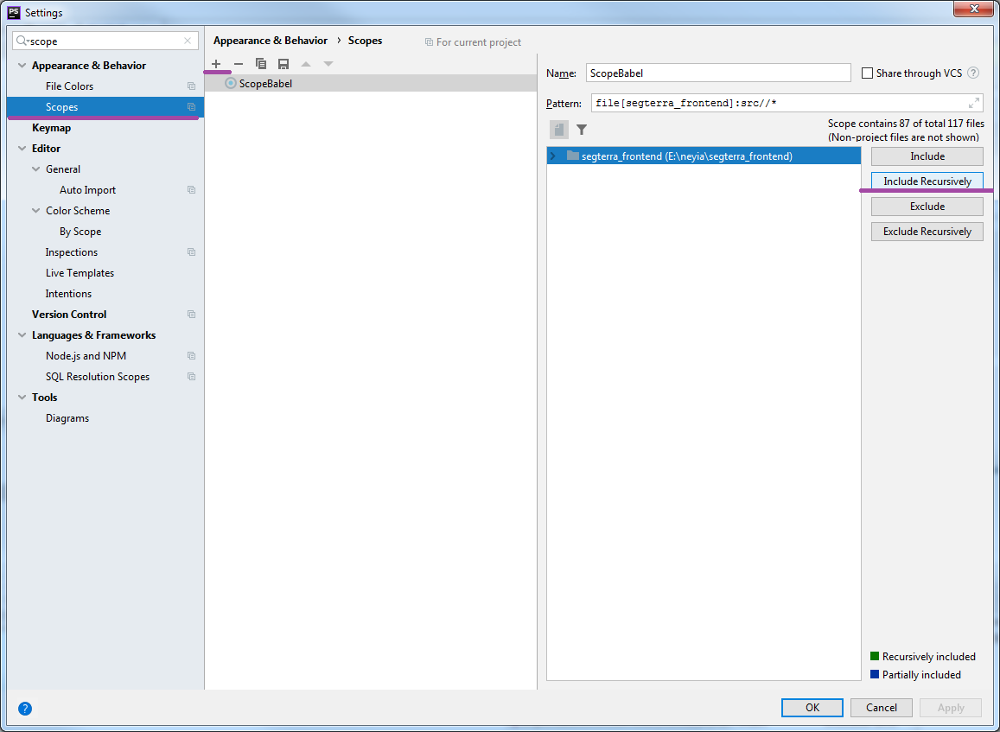

# Segterra Frontend

Style Guide. https://neyia.github.io/segterra_frontend/
Main idea - making reusable components.

# Install

npm i

# Gulp

Gulp is a build tool in JavaScript 'build' on node streams. Working directory - 'scr'.

**gulp-file-include** - a plugin of gulp for file include

**gulp-less** - a less plugin for gulp

**gulp-autoprefixer** - prefix css with autoprefixer 

**gulp-clean-css** - a gulp plugin to minify css, using clean-css

**webpack-stream** - run webpack as a stream to conveniently integrate with gulp.

**gulp-imagemin** - a gulp plugin to minify images

**imagemin-jpegoptim** - imagemin plugin for jpegoptim 

**gulp-svgstore** - a gulp plugin to combine svg files into one with symbol.
 
**gulp-rename** - a gulp plugin to rename files easily

**parallel** - combines task functions and/or composed operations into larger operations that will be executed simultaneously

**gulp-notify** - notification plugin for gulp  

# Tasks

1. **html** (use gulp-file-include) - moving html files from 'src' to 'build' folder 

2. **styles** (use gulp-less, gulp-autoprefixer, gulp-clean-css) - converting to css, adding prefixes, cleaning and moving files from 'src' to 'build' folder.

3. **scripts** (use webpack-stream) - ..

4. **img** (use imagemin) - minified images and moving files from 'src' to 'build' folder  

5. **svgsprite** (use gulp-svgstore, gulp-rename) - creating svg-sprites

6. **clean** - cleaning build folder

7. **watch** - watcher + parallel

8. **serve** (browser-sync) - live reload

9. **dev** - main task for the developing

 # Code Style

Segterra_Front_CodeStyle.xml

# Babel watcher settings

# Babel scope settings

# segterra_local_frontend
